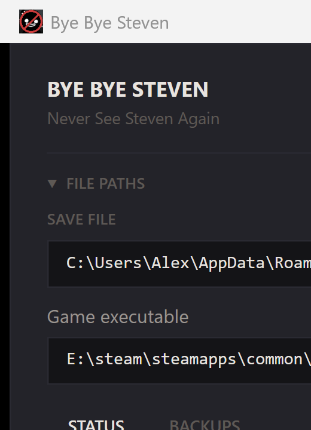

# Bye Bye Steven

[English](../README.md) | [简体中文](README.zh-CN.md) | **[繁體中文](README.zh-TW.md)** | [日本語](README.ja.md) | [한국어](README.ko.md)

一個 Windows 工具，用於移除 [Mewgenics](https://store.steampowered.com/app/686060/Mewgenics/) 中 **Steven** 的反 SL 懲罰。

Steven 是一個能偵測到你重新載入存檔的 NPC，然後會出來懲罰你。這個工具一鍵重置懲罰。

<p align="center">
  
</p>

## 功能

- 一鍵移除懲罰
- 修改前自動備份存檔
- 重啟並清除：關閉遊戲、移除懲罰、重新啟動一步到位
- 自動偵測存檔檔案和遊戲程式路徑
- 支援 5 種語言（英/簡中/繁中/日/韓）

## 下載

前往 [Releases](https://github.com/TaliesinYang/mewgenics-bye-bye-steven/releases) 頁面下載最新版本。

單個便攜 `.exe`，無需安裝。

## 使用方法

1. 執行 `ByeByeSteven.exe`
2. 存檔路徑會自動偵測
3. 點擊 **移除懲罰** 重置 Steven 標記
4. 或使用 **重啟並清除** 一鍵關閉遊戲、清除懲罰並重啟

> 移除懲罰前請先關閉 Mewgenics，避免檔案鎖定問題。

## 從原始碼構建

需要 [.NET 9 SDK](https://dotnet.microsoft.com/download/dotnet/9.0)。

```bash
dotnet publish src/MewgenicsSaveGuardian.csproj -c Release -o publish
```

## 授權條款

[CC BY-NC 4.0](../LICENSE) - 可自由使用和修改，禁止商用。
